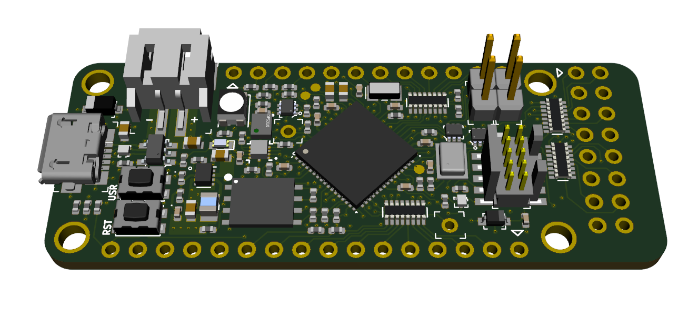
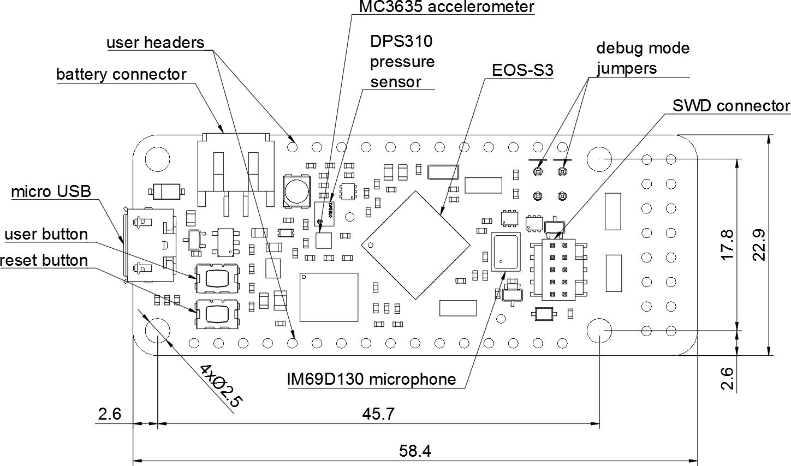

==============================
QuickFeather Development Board
==============================

Overview
========

This repository contains open hardware design files for the `QuickFeather development board <https://www.quicklogic.com/products/eos-s3/quickfeather-development-kit/>`_ based on the QuickLogic `EOS S3 Sensor Processing Platform <https://www.quicklogic.com/products/eos-s3/>`_.
The design files were created by `Antmicro <https://www.antmicro.com>`_ in cooperation with `QuickLogic <https://www.quicklogic.com/>`_.
The board has been designed to keep compatibility with the `Adafruit Feather <https://learn.adafruit.com/adafruit-feather/feather-specification>`_ ecosystem of evaluation boards.
This allows the user to explore functionalities of the EOS S3 platform.

Getting Started
---------------
The  `QuickFeather_UserGuide <https://github.com/QuickLogic-Corp/quick-feather-dev-board/blob/master/doc/QuickFeather_UserGuide.pdf>`_ contains instructions for running the pre-installed example program.

Key features
------------

* QuickLogic EOS S3 Processing Platform
* `mCube MC3635 <https://mcubemems.com/wp-content/uploads/2019/06/MC3635-Datasheet-APS-048-0044v1.6.pdf>`_ accelerometer
* `Infineon DPS310 <https://www.infineon.com/dgdl/Infineon-DPS310-DataSheet-v01_01-EN.pdf?fileId=5546d462576f34750157750826c42242>`_ pressure sensor
* `Infineon IM69D130 <https://www.infineon.com/dgdl/Infineon-IM69D130-DS-v01_00-EN.pdf?fileId=5546d462602a9dc801607a0e46511a2e>`_ MEMS microphone 
* 16Mbit of on-board `flash memory  <http://www.gigadevice.com/datasheet/gd25q16c/>`_
* User button and RGB LED
* Powered from USB or a single Li-Po battery
* Integrated `battery charger <http://ww1.microchip.com/downloads/en/DeviceDoc/20001984g.pdf>`_
* USB data signals tied to programmable logic
* IO signals break-routed into general purpose pinheads
* Compatible with standard 0.1" breadboards

Layout and dimensions
---------------------

Development ecosystem
=====================

Simulation
----------

The board is supported in `Renode <https://renode.io/>`_, the open source simulation framework by Antmicro - you can run a virtual copy of this hardware for software development purposes on your PC. A link to the relevant demo script is provided in Renode's `supported boards section <https://renode.readthedocs.io/en/latest/introduction/supported-boards.html>`_.

Basic Usage
=====================

Simple
----------

Connect the micro-usb port of the board to the PC, which will both provide power to the board as well as offer a virtual USB-CDC UART port out of the box.

Advanced
----------

For using the board with advanced scenarios, such as loading a custom FPGA image, an additional dedicated USB-UART board (for example based on the PL2303, FT232 etc.) needs to be connected to the QuickFeather UART pins, as shown below:
::

      +--------------------------+         +--------------+  
      | QF UART RX(IO_45) [J3.3] +-------->+ USB-UART TX  |  
      |                          |         |              |  
      |                          |         |              |  
      | QF UART TX(IO_44) [J3.2] +-------->+ USB-UART RX  |  
      |                          |         |              |  
      |                          |         |              |  
      | QF GND      (GND) [J3.1] +-------->+ USB-UART GND |  
      +--------------------------+         +--------------+  

Refer to `QuickFeather_UserGuide <https://github.com/QuickLogic-Corp/quick-feather-dev-board/blob/master/doc/QuickFeather_UserGuide.pdf>`_ for further details
